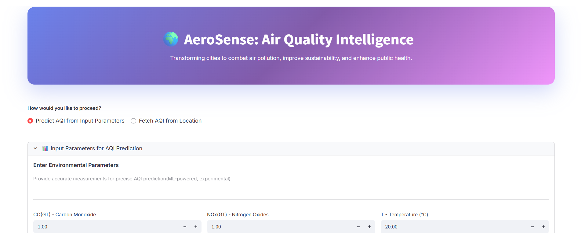
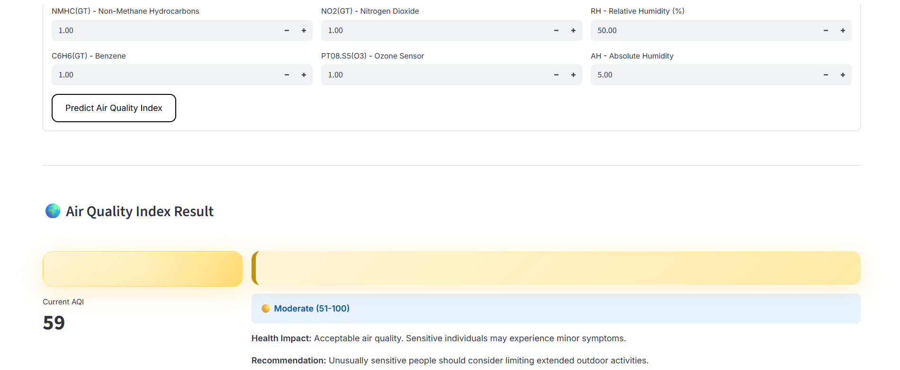
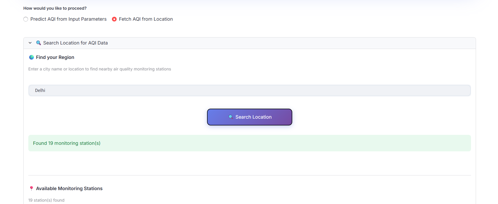
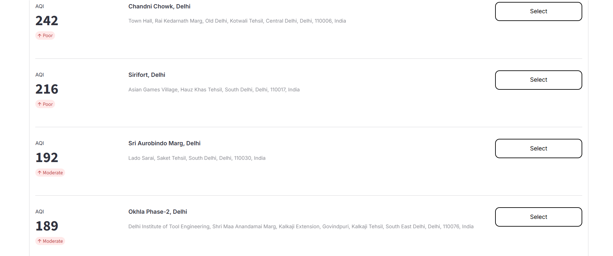
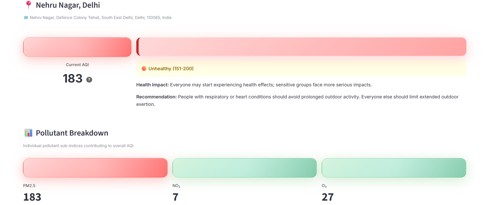
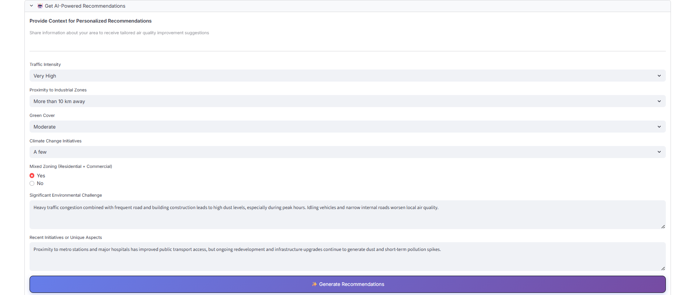

# AeroSense: Air Quality Intelligence 🌍

AeroSense is an air quality monitoring and prediction platform that combines real-time air quality data, advanced machine learning models to deliver accurate AQI predictions and AI-powered recommendations for improving air quality and public health.

## ✨ Features

- **🎯 Dual Mode Operation**:
  - **Predict AQI**: Use ML ensemble models (Neural Network + XGBoost + Random Forest) to predict AQI from environmental parameters
  - **Fetch Real-Time AQI**: Search and retrieve live air quality data from 8000+ monitoring stations worldwide

- **🌍 Global Location Search**: Search any city worldwide and select from nearby monitoring stations with real-time AQI readings

- **📊 Comprehensive Pollutant Breakdown**: View detailed sub-indices for PM2.5, PM10, NO₂, SO₂, O₃, and CO with color-coded health indicators

- **🤖 AI-Powered Recommendations**: Get personalized, actionable recommendations from Gen AI model based on:
  - Current AQI levels
  - Traffic intensity
  - Industrial proximity
  - Green cover
  - Climate initiatives
  - Environmental challenges

- **💬 Interactive Follow-up**: Ask detailed follow-up questions to get deeper insights and implementation guidance

## 🚀 Installation

1. **Clone the repository**:
    ```sh
    git clone https://github.com/samfusedbits/aerosense.git
    cd aerosense
    ```

2. **Install dependencies**:
    ```sh
    pip install -r requirements.txt
    ```

3. **Set up secrets** in `.streamlit/secrets.toml`:
    ```toml
    AQI_TOKEN = ""              # AQI data provider token
    SEARCH_URL = ""             # Location search endpoint
    FEED_URL = ""               # AQI feed endpoint
    API_KEY = ""                # LLM provider API key
    MODEL_NAME = ""             # LLM model name
    BASE_PROMPT = ""            # Base prompt template
    FOLLOWUP_PROMPT = ""        # Follow-up prompt template
    RECOMMENDATION_PROMPT = ""  # Recommendation prompt template
    ```

## 📖 Usage

1. **Run the application**:
    ```sh
    streamlit run aerosense.py
    ```

2. **Access the application**:
    - Open your browser and go to `http://localhost:8501`

3. **Choose your mode**:
    - **Predict AQI**: Input environmental parameters (CO, NOx, NO₂, PM2.5, temperature, humidity, etc.) for ML-based prediction
    - **Fetch AQI**: Search for your city and select a nearby monitoring station for real-time data

4. **Get AI Recommendations**:
    - After viewing AQI results, expand the AI recommendations section
    - Fill in contextual information about your area
    - Receive tailored suggestions for improving air quality
    - Ask follow-up questions for deeper insights

## 📸 Screenshots

### Main Interface

*Choose between predicting AQI from environmental parameters or fetching real-time data from monitoring stations*

### Predict AQI from Parameters

*Enter environmental parameters for ML-powered AQI prediction"

### Location Search

*Search any city worldwide and browse nearby monitoring stations with live AQI data*

### Available Monitoring Stations

*Browse through nearby monitoring stations showing current AQI levels and select one for detailed data*

### AQI Results & Pollutant Breakdown

*Color-coded AQI display with detailed pollutant sub-indices and health recommendations*

### AI-Powered Recommendations

*Get personalized, actionable recommendations based on your area's environmental context*

## 📊 ML Models

The prediction ensemble consists of:
- **Neural Network** (`best_model.keras`)
- **XGBoost** (`xgboost_model.joblib`)
- **Random Forest** (`random_forest_model_compressed.joblib`)
- **MinMax Scaler** (`minmax_scaler.joblib`)

Final prediction = Average of all three models

## **AQI Scale**
    US EPA Air Quality Index (AQI)

## 🔗 Live Demo

Experience AeroSense live at: [aerosense.streamlit.app](https://aerosense.streamlit.app)